<p align="center">
  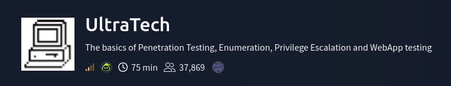
</p>

---

## Objectives
### Task 1
- Which software is using the port 8081?
- Which other non-standard port is used?
- Which software using this port?
- Which GNU/Linux distribution seems to be used?
- The software using the port 8081 is a REST api, how many of its routes are used by the web application?

. . .
### Task 2
- There is a database lying around, what is its filename?
- What is the first user's password hash?
- What is the password associated with this hash? <br>

. . .
### Task 3
- What are the first 9 characters of the root user's private SSH key?

---

## Attack Path

`Enumeration` → `Initial Access` → `Privilege Escalation`

---

## Enumeration

I scanned the target host with `nmap` to enumerate open ports, running services and their versions by executing the command below:
```bash
nmap -sS -sVC <target_host_IP> -oN <filename>
```

<p align="center">
  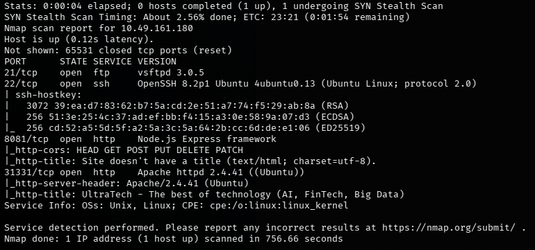
</p>

There are four services running: an `ftp` server on port 21, `ssh` service on port 22, `Express.js` server on port 8081, and an `Apache` server on port 31331. <br>
The `ftp` server doesn't allow `anonymous` logins, so I went to enumerating the `web server` on port 31331.

<p align="center">
  
</p>

The homepage did not reveal any useful information. <br>
I began enumerating the `web app` to discover any accessible directories or files using `ffuf`.

<p align="center">
  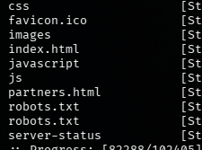
</p>

Looking at the results, the `web app` has a `robots.txt` file, which specifies which areas of the website should
or should not be crawled by web crawlers.

<p align="center">
  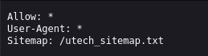
</p>

<p align="center">
  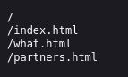
</p>

The contents of `robots.txt` lead me to a `sitemap` file named `utech_sitemap.txt`. <br>
`Sitemaps` are used to list a `web app`'s pages so search engines can find and index them quickly. <br>
After viewing the contents of the `sitemap`, it shows 2 additional routes namely `/what.html` and `/partners.html` that has been discovered previously by `ffuf`.

<p align="center">
  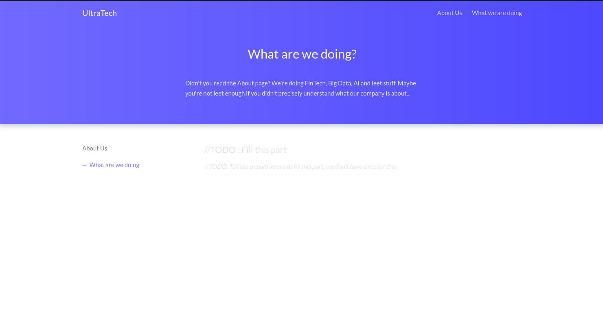
</p>

<p align="center">
  
</p>

Visiting `/what.html` leads to nothing. So the next step is to visit `/partners.html`. <br>
`/partners.html` shows a login page. This is where I will start and try to get a foothold inside the system.

<p align="center">
  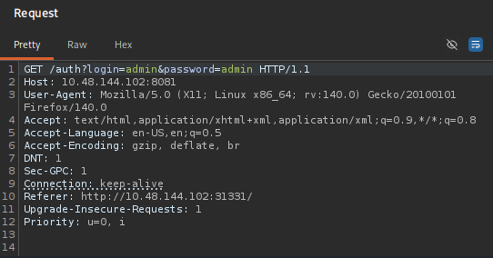
</p>

I opened up `BurpSuite`, a `web proxy` that will help me intercept and manipulate web requests, and see what the `web request`
would look like when I try to login with some default credentials. <br>
The login page is making a request to the `Express.js` endpoint at `/auth`. It responded with a page saying "invalid credentials". <br>
Before continuing any further, I wanted to know what other endpoints there are available. <br>

<p align="center">
  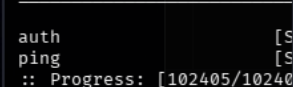
</p>

Using `ffuf` once more to discover any accessible endpoints, it showed there were two, namely `auth` and `ping`.
```bash
# Task 1 is complete up to this point
```

---

## Initial Access

I switched my focus from `auth` to the `ping` endpoint. <br>
`BurpSuite` was also continually intercepting a web request at `/ping`.

<p align="center">
  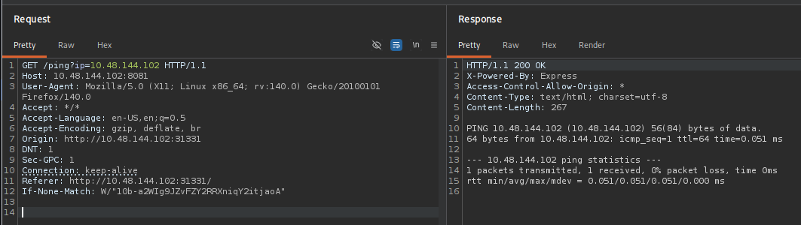
</p>

I sent the request to `BurpSuite Repeater` so I can manually manipulate and send the requests repeatedly. <br>
The web app periodically makes requests to the `/ping` endpoint, which appears to execute the `ping` command against its own IP address. <br>
This could represent a potential attack vector for `command injection`.


<p align="center">
  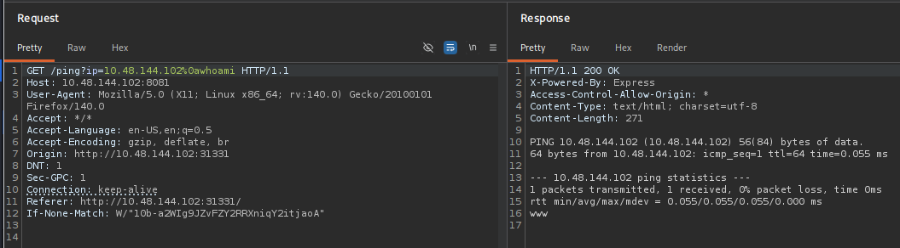
</p>

After several unsuccessful attempts using different techniques, I was able to inject the `whoami` command by appending `%0a`, which is
the URL-encoded representation of a newline character. <br>
The command executed successfully and revealed the user account `www` under which the web application was running.

<p align="center">
  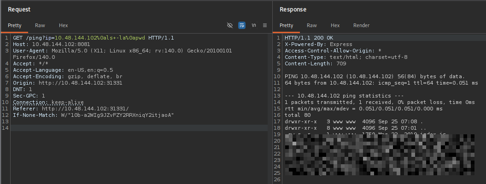
</p>

<p align="center">
  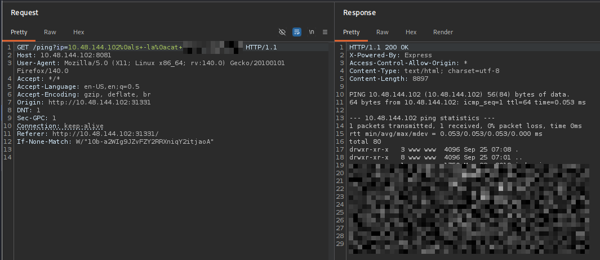
</p>

While enumerating the directories and files for Task 2, I found the database file used by the `/partners.html` login page. <br>
It contained two user accounts along with their usernames and hashed passwords. <br>
I saved both hashes to try and crack the passwords.

<p align="center">
  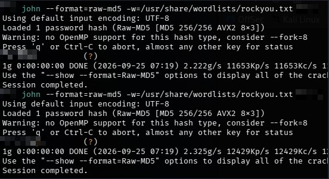
</p>

Before attempting to crack the passwords, I first needed to identify the hashing algorithm used. <br>
I used `hashid` and `hash-identifier` to identify the hash type and determined that both passwords were hashed using `MD5`. <br>
Using the password-cracking tool `John the Ripper`, I was able to recover the plaintext passwords from both hashes.
```bash
# Task 2 is complete up to this point
```

---

## Privilege Escalation

For this part, the privilege escalation was relatively straightforward. I logged in to one of the accounts discovered previously
via `ssh` using the recovered password.

<p align="center">
  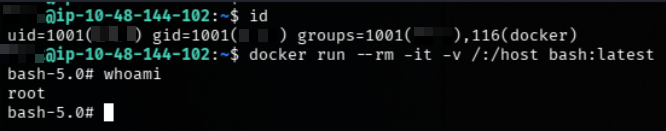
</p>

<p align="center">
  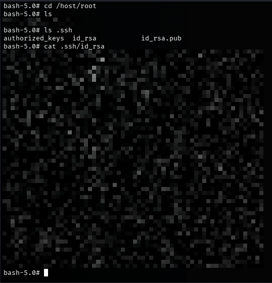
</p>

Afterwards, I checked which groups the account belonged to and found that it was a member of the `docker` group. <br>
> Docker is an open-source platform used to automate the deployment of applications inside lightweight,
> portable packages called containers.

Since members of the `docker` group can interact with the Docker daemon, I created a container and mounted the host's root directory `/` to `/host`
inside the container. <br>
I then used the latest `bash` image, which runs as `root` by default, to obtain a root shell on the host system, as shown below:
```bash
docker --rm -it -v /:/host bash:latest
```

```bash
# Task 3 is complete
```
